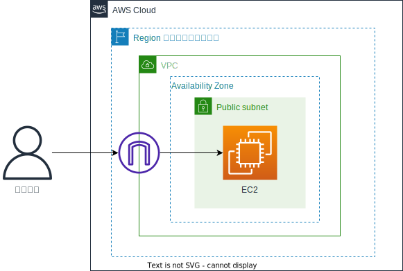

クラウドアーキテクト・ファーストステップ ラボ1
==
#### 〜 AWS EC2による仮想マシンの構築 〜
###### v23.08.22.01


# 概要
- AWSの仮想マシンサービスであるEC2上に仮想マシンを構築し、Webサーバを稼働させます
- Nginxのページがブラウザに表示されたら成功です！


- 所要時間は約20分です

---

# この演習で学べること
- AWSマネージメントコンソールの基本的な使い方
- EC2インスタンスの構築方法
# 演習の前にお読みください
- マネージメントコンソールへのログインURL、ユーザー名、パスワードは受講当日に講師から伝えられます
- マネージメントコンソールへの文字入力は、必ず半角英数字でのみ行ってください
- 手順中に設定の指示がない場合は、画面上での値の入力や変更は不要です。次の手順に進んでください
- 設定値を入力する場合は、できるだけコピペしてください。手入力は記載ミスの恐れがあります
- 演習手順について講師に確認する場合は、項目の番号をお伝え下さい。例：2-3の手順5番
## 凡例
- 手順書内での凡例は以下の通りです。ご活用ください
    - 補足
    > 作業手順の補足事項を記載しています
    - 予備知識
    :::tip
    予備知識を記載しています
    :::
    - 注意 
    :::warning
    主に、作業ミスの起きやすいポイントや注意事項を記載しています
    :::
    - 動作不良等
    :::danger
    うまく動作しないときに確認するポイントを記載しています。講師に確認する際に、ご自分でもチェックしてみてください
    :::
# 演習環境の有効期限等について
- 演習環境の有効期限は、講義当日の23時までです。23時以降になると、パスワードが変更され利用できなくなります
- 演習で作成したリソースは、20時になると自動で削除されますのでご了承ください
- 講義終了後の演習環境でのログインは、上記時間までご自由に実施ください。演習を再度実行したい場合は、作成したリソースを削除してから実施してください

---

# 演習手順
## 1. AWSコンソールへのログイン
1. 講師から伝えられたログイン用のURLにWebブラウザでアクセスしてください。AWSのログイン画面が開きます
    > Zoomのチャットで配布された場合は、クリックするだけで画面が開きます
3. 講師から伝えられたユーザー名及びパスワードを入力して [サインイン] ボタンを押下してください

    ::: tip 
    ログイン直後の画面に**新しいAWSコンソールのホーム**というボックスが表示されることがあります。その場合は**新しいコンソールのホームに切り替える**というボタンを押してください。AWSのマネージメントコンソールは、ユーザーの要望を取り入れて日々進化しているため、このような表示が出ることがあります
    :::

4. マネージメントコンソールがブラウザ上に表示されます。AWSの世界へようこそ！
    > パスワードを保存するかを確認されることがありますが、どちらでも構いません。再ログインする可能性がある場合は、手間を省くために保存しても結構です
2. 画面右上に**東京**と表示されていることを確認してください。東京以外の表示になっている場合はその地名をクリックし、ドロップダウンボックスから**東京**を選択してください

## 2. セキュリティグループの作成
- ファイアーウォールの機能であるセキュリティグループを作成します。今回はWebサーバを構築するため、インターネット全体からのHTTP(TCP/80)を受け付けるファイアウォールを設定します
#### 手順
1. 画面左上の虫眼鏡アイコンのボックスに**EC2**と入力します（小文字でも可）。表示された一覧から**EC2**をクリックしてください
    > EC2という文字をクリックしてください。他の箇所はクリックしても反応しません
4. EC2のダッシュボードが表示されます。「おかえりなさい」という吹き出しが表示されることがありますが、無視してかまいません
5. 左側のメニューにて、**セキュリティグループ**をクリックしてください
6. 右上の [セキュリティグループの作成] ボタンを押下してください
7. 以下を設定します
    |項目|設定値
    |:--|:--
    |セキュリティグループ名|web-sg
    |説明|web server security group 
    |VPC|表示されているものを X で削除したのち、選択肢の中からLabVPCを選択

8. インバウンドルール欄の [ルールを追加] ボタンを押下してください
9. **カスタムTCP**をクリックし、**HTTP**を選択
10. ソース欄にある空白のボックスをクリックし、選択肢から**0.0.0.0/0**を選択
11. 右下の [セキュリティグループを作成] ボタンを押下してください
12. 作成したセキュリティグループの詳細画面に遷移します。時間に余裕があれば内容を確認してください

## 3. EC2インスタンス作成
- WebサーバとなるEC2インスタンスを起動します
- サーバアプリケーションであるNginxは、ユーザーデータ（後述）を使ってインスタンス起動時に自動でインストールされるようにします。ですので簡単な設定だけでWebサーバを利用できます
#### 手順 
1. 画面左上の虫眼鏡アイコンのボックスに**EC2**と入力します（小文字でも可）。表示された一覧からEC2をクリックしてください。EC2のダッシュボードが表示されます
    > 最初の作業でセキュリティグループの作成を行っているので、セキュリティグループの画面が表示されるかもしれませんが、気にせず先の手順に進んでください
1. 左側メニューで、**インスタンス**をクリックしてください
    > 先頭に三角のアイコンの付いていない方をクリックしてください
2. 画面右上にある [インスタンスを起動] ボタンを押下してください。インスタンスを起動するための画面に遷移します

    :::tip
    EC2インスタンスを作成することを、「起動」と言います。また、「シャットダウン」はEC2インスタンスの削除を意味します
    :::

1. **名前とタグ**のボックスに、インスタンスの名前を設定します。ボックスに websv と入力したら、次に進んでください
2. 起動するOSを確認します。以下を2点を確認してください。通常はデフォルトで選択されていますので、変更の必要はありません
   - **説明**の下に、**Amazon Linux 2023** とあること
   - **アーキテクチャ**が、 **64ビット (x86)** になっていること
3. もし表記が上記と異なっている場合は、**Amazonマシンイメージ（AMI)** のドロップダウンボックスから、上記の 説明 の状態になるものを選択してください
6. 次にインスタンスタイプ、つまりインスタンスのスペックを確認します。インスタンスタイプの下の表記が **t2.micro** であることを確認してください。もし異なる場合は、ドロップダウンボックスから t2.micro を選択してください
7.  次のキーペアは今回は利用しません。ドロップダウンボックスから、 **キーペアなしで続行** を選択してください
    :::tip
    キーペアは、インスタンスにSSHログインするための認証鍵です。今回はSSHではない方法でインスタンスにログインするので不要です
    :::

8. 次はネットワークの設定を行います。右にある [編集] ボタンを押して、以下を設定してください

    |項目|設定値
    |:--|:--
    |VPC|LabVPC
    |サブネット|PublicSubnet
    |パブリックIPの自動割り当て|有効化<br>※自動で設定されているはずですが、ご確認ください
    |ファイアーウォール（セキュリティグループ）|既存のセキュリティグループを選択する を選択したあと、<br>共通のセキュリティグループにて web-sg を選択

    :::warning
    次に進む前に、以下をよく確認してください<br>
    - サブネットの選択で、**PublicSubnet** を選択しているか<br>
    - セキュリティグループで、**web-sg** を選択しているか
    :::

9. ストレージを設定 は変更不要です。そのまま先に進んでください

10. 高度な詳細 を2か所設定します（指示のない場所は変更不要です）。もし、高度な詳細のメニューが開かれていない場合は、頭にある▼をクリックして展開してください

11. IAMインスタンスプロフィール のドロップダウンボックスから **Ec2DefaultRole** を選択してください

12. **ユーザーデータ**が表示されるまで下にスクロールし、ボックスに以下の全ての行をコピペしてください
    ```shell
    #!/bin/bash
    sudo dnf update -y
    sudo dnf install -y nginx docker
    sudo service nginx start
    sudo service docker start
    sudo usermod -aG docker ssm-user
    ```
    ::: tip
    ユーザーデータは、EC2インスタンスの起動時にスクリプトを自動で実行してくれる機能です。
    ミドルウェアのアップデートなどOSのインストール後に必ず実行する処理や、アプリケーションのインストール作業などを自動化することができます。<br>
    今回は、WebサーバであるNginxの他、ラボ2で利用するDockerのインストールもここで済ませています
    :::

23. これで設定は完了です。[インスタンスの起動] ボタンを押下してください。画面が遷移し、情報が表示されます。[インスタンスの表示] ボタンを押下してください
24. インスタンスの状態が **保留中**から**実行中**に変わるまでお待ちください（通常数十秒で変わります）
    > 保留中という表記は pending と表示されることもあります。同じく、実行中の表記は running と表示されることがあります

## 4. 動作確認
1. Webページを表示するため、利用中のブラウザで別のタブを開いてください
1. インスタンスの行をどこでもよいのでクリックしてください。画面下半分にインスタンスの情報が表示されます 
2. 右の列に**パブリックIPv4 DNS**という記載があるので、そのアドレスを先ほど開いたブラウザタブにコピペしてください

    :::tip
    アドレスは、ホスト名の左にある四角いアイコンをクリックするとコピーできます
    :::

    :::warning
    「オープンアドレス」はクリックしないでください。HTTPSでのアクセスのため、今回は利用できません
    :::

3. ブラウザに、 **Welcome to nginx!** と表示されたら成功です

# おわりに
- お疲れ様でした！演習はいかがだったでしょうか？
- このプロセスと同じことを、もしオンプレミスで実施した場合、どれくらいの時間と手間がかかったでしょうか？  クラウドの便利さや手軽さが伝われば幸いです。
- もしよろしければ、Zoomチャットなどで演習の感想を聞かせてください！
